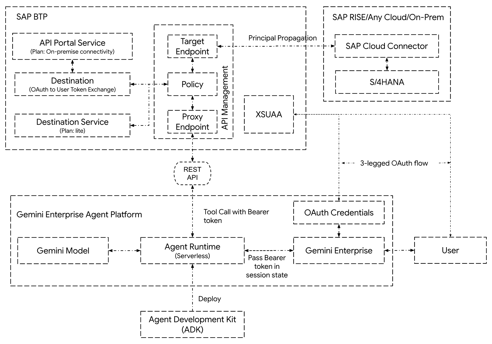
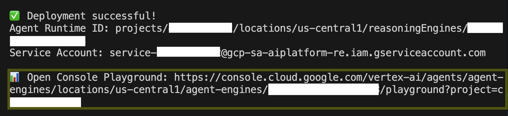
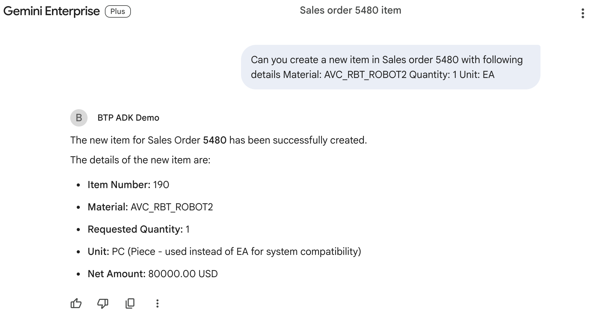

# Tutorial: Consume SAP BTP APIs with Principal Propagation in Google Cloud ADK Agents 

**Tech Stack**: `Google Cloud ADK`, `Agent Runtime`, `Gemini`, `SAP BTP`, `API Management`, `XSUAA`, `Python`  
---

# **1. Introduction**

### **Objective**

Building on our previous tutorial, this guide covers exposing a backend **SAP ERP** OData API through **SAP BTP API Management (APIM)** and consuming it with an **ADK-based** agent deployed to **Agent Runtime**. You will learn to configure policies, destinations, and supporting services in SAP BTP API Management for principal propagation, ensuring that the user context from Gemini Enterprise is carried over to the backend SAP ERP application.

### **Scope**

*   Set up **SAP BTP** Destinations and service instances for user token exchange.
*   Import **policy templates** and attach them to an **APIM API** to automate token exchange for user-delegated login.
*   Update the **ADK agent** to use the `OpenAPIToolSet` to consume the APIM API.
*   Test the agent using the Gemini Enterprise UI.

### **Out of Scope**

*   Installation and configuration of the backend SAP ERP application.
*   Installation and configuration of the SAP Cloud Connector.
*   Multi-subaccount setup in SAP BTP.
*   Set up of the API provider and API proxy in SAP BTP API Management.

## **2\. Prerequisites & Setup**

Before you begin, ensure you have the following:

*   You have fully completed the previous tutorial (including its prerequisites) and have successfully:
    *   Deployed and secured the currency conversion API to your SAP BTP subaccount.
    *   Deployed the ADK agent to Agent Runtime.
    *   Registered the ADK agent with Gemini Enterprise.
    *   Tested the agent successfully through Gemini Enterprise.

### **SAP BTP Resources**

*   [**SAP Integration Suite**](https://www.sap.com/products/technology-platform/integration-suite.html) with [**API Management Capability**](https://help.sap.com/docs/integration-suite/isuite-integrations-and-apis/activate-and-configure-api-management-capability?locale=en-US&version=LATEST) enabled.
    *   Follow the [Set Up API Management from Integration Suite](https://developers.sap.com/tutorials/api-mgmt-isuite-initial-setup.html) tutorial if required.

### **Local Development Environment**

*   [**Cloud Foundry Command Line Interface (CLI)**](https://developers.sap.com/tutorials/cp-cf-download-cli.html) installed and configured to log into your BTP instance.
*   [**SAP BTP Command Line Interface (btp CLI)**](https://developers.sap.com/tutorials/cp-sapcp-getstarted.html) installed and configured to log into your BTP instance.
* You have administrator access to your BTP subaccount

## **3\. Architecture Overview**

The following diagram shows the relationships between components and the process flow that enables principal propagation to the backend SAP ERP application. We will later detail how to create and configure the necessary SAP BTP components.



**Steps in the Gemini Enterprise Agent Platform**

*   When a user accesses the agent for the first time, Gemini Enterprise initiates a 3-legged OAuth flow to obtain access and refresh tokens.
*   Once valid tokens are obtained, Gemini Enterprise securely stores them and passes the access token in a state variable to the ADK agent.
*   Gemini Enterprise manages the complexity of automatically refreshing access tokens using the refresh tokens.
*   The ADK agent retrieves the access token from the state and calls the BTP API proxy endpoint, passing the user's access token in the header as a bearer token.

**Steps in BTP API Management**

*   The proxy endpoint begins the pre-flow pipeline according to the attached API Management policy.
*   The policy first executes a script to initiate a Client Credentials OAuth flow and get an access token for the `OAuth2UserTokenExchange` destination.
*   Next, the policy calls the `OAuth2UserTokenExchange` destination with the following headers:
    *   `X-user-token`: The user access token received from the ADK agent.
    *   `Authorization`: `Bearer <Access token from the previous step>`.
*   The `OAuth2UserTokenExchange` destination internally calls the API Portal service instance to exchange the user token for another authentication token.
*   Finally, the policy calls the target endpoint using the new authentication token. This allows API Management to call the backend ERP on behalf of the user, passing the user context to the target.

**Steps in the Backend SAP ERP Environment**

*   The call to the target endpoint is routed through the Cloud Connector, where an X.509 certificate is generated for the user context and attached to the request before forwarding it to the backend SAP ERP application.
*   The SAP ERP application receives the request with the X.509 certificate. It determines the SAP user ID based on the certificate-to-user mapping and performs the OData operations under that user's identity.

## **4\. Configure BTP API Management and Redeploy the Agent**

If you have not gone through the previous tutorial, please do so now. The remainder of this document will walk you through making changes to the code and configuration files you created in that tutorial.

### **Step 1: Create a Destination Service Instance (plan: lite) and Service Key**

This service instance will be used within an API Management policy (Step 7 in the architecture diagram) to access other destinations, such as the one for exchanging the BTP user token.

```shell
# Create destination service
cf create-service destination lite apim-destination

# Create destination service key
cf create-service-key apim-destination apim-destination-sk

# View the service key. Save the JSON output securely, as you will need it later.
cf service-key apim-destination apim-destination-sk
```

### **Step 2: Create an API Management API Portal Service Instance (plan: on-premise-connectivity) and Service Key**

This service instance will be used by the destination you create in the next step (Step 9 in the architecture diagram) to exchange a user token for another token for principal propagation.

```shell
# Log in to SAP BTP if you aren't already
cf login

# Create apimanagement-apiportal service
cf create-service apimanagement-apiportal on-premise-connectivity apim-onprem-connectivity

# Create apimanagement-apiportal service key
cf create-service-key apim-onprem-connectivity apim-onprem-connectivity-sk

# View the service key. Save the JSON output securely, as you will need it in the next step.
cf service-key apim-onprem-connectivity apim-onprem-connectivity-sk
```

### **Step 3: Create an HTTP Destination with "OAuth2UserTokenExchange"**

This destination will be used within the API Management policy (Step 8 in the architecture diagram) to exchange a user token.

**Note:**

*   You will need your BTP subaccount ID. See [Find Your Subaccount ID](https://help.sap.com/docs/connectivity/sap-btp-connectivity-cf/find-your-subaccount-id-cloud-foundry-environment) for instructions.
*   You will need your API Management service virtual host, found in your API Management runtime settings (see Step 5 of the [Set Up API Management from Integration Suite](https://developers.sap.com/tutorials/api-mgmt-isuite-initial-setup.html) tutorial).
*   You will need your [BTP tenant region ID](https://help.sap.com/docs/btp/sap-business-technology-platform/regions-and-api-endpoints-available-for-cloud-foundry-environment) (e.g., `us30`).

```shell
# Log in to SAP BTP if you aren't already
btp login

# Set your subaccount as the target
btp target --subaccount <REPLACE_WITH_YOUR_SUBACCOUNT_ID>

# View the service key created in the previous step. You will use its JSON output in the next command.
cf service-key apim-onprem-connectivity apim-onprem-connectivity-sk

# Create the destination
btp create connectivity/destination \
    -c '{
        "Name": "apim-user-token-exchange-destination",
        "Type": "HTTP",
        "clientId": "<REPLACE_WITH_clientID_FROM_JSON_OUTPUT>",
        "clientSecret": "<REPLACE_WITH_clientSecret_FROM_JSON_OUTPUT>",
        "tokenServiceURL": "<REPLACE_WITH_tokenUrl_FROM_JSON_OUTPUT>",
        "ProxyType": "Internet",
        "URL": "https://<REPLACE_WITH_API_MANAGEMENT_VIRTUAL_HOST>.apimanagement.<REPLACE_WITH_BTP_TENANT_REGION_ID>.hana.ondemand.com",
        "Authentication": "OAuth2UserTokenExchange"
    }'
```

### **Step 4: Import API Management Policy Template**

First, download the sample [PolicyTemplateContainer](/adk-btp-apim/PolicyTemplateforADK/PolicyTemplateContainer) folder.

> **Tip:** Clone this repo locally for easy access.

Then in that folder, open the file `FileResource/setConfigJson.js` and update the following fields in the `configObj`:

*   **`issuer`**: Execute `cf service-key adk-demos adk-demos-sk` to get the XSUAA service key details. Take the `url` from the JSON output and append `/oauth/token`. (e.g., `https://xxxxxxx.authentication.us30.hana.ondemand.com/oauth/token`)
*   **`publicKey`**: From the JSON output above, copy the `verificationkey`. (e.g., `-----BEGIN PUBLIC KEY-----\nMIIBIjANBgkqhkiG9w0...`)
*   **`destinationURI`**: Execute `cf service-key apim-destination apim-destination-sk` to get the Destination service key. Take the `uri` from the JSON output and remove "https://". (e.g., `destination-configuration.cfapps.us30.hana.ondemand.com`)
*   **`destinationAuthEndpoint`**: From the JSON output above, take the `url` and remove "https://". (e.g., `xxxxxxx.authentication.us30.hana.ondemand.com`)
*   **`destinationClientId`**: From the JSON output above, copy the `clientid`. (e.g., `sb-clonexxxx`)
*   **`destinationClientSecret`**: From the JSON output above, copy the `clientsecret`. (e.g., `a0c20cea-ee57-xxxxx`)

```javascript
var configObj = {
    "enableDebug": false,
    "invalidateCache": false,
    "accounts": {
        "dummyname": {
            "issuer": "<REPLACE_ISSUER>",
            "publicKey": "<REPLACE_PUBLICKEY>",
            "destinationName": "apim-user-token-exchange-destination",
            "destinationUri": "<REPLACE_DESTINATION_URI>",
            "destinationAuthEndpoint": "<REPLACE_DESTINATION_AUTH_ENDPOINT>",
            "destinationClientId": "<REPLACE_DESTINATION_CLIENT_ID>",
            "destinationClientSecret": "<REPLACE_DESTINATION_CLIENT_SECRET>"
        }
        // ... rest of the file
    }
    // ...
  	context.setVariable("myVar.destination.doQueryForFreshToken", doQueryForFreshToken)
}
```

Now, zip the `PolicyTemplateContainer` folder and upload it to API Management using the [Import a Policy Template](https://help.sap.com/docs/sap-api-management/sap-api-management/import-policy-template?locale=en-US&version=LATEST) procedure.

### **Step 5: Create a new API Proxy and apply the policy template**

In this tutorial, we will expose the [Sales Order (A2X) OData service](https://hub.sap.com/api/OP_API_SALES_ORDER_SRV_0001/resource/Sales_Order_Header) from a backend SAP ERP application. Setting up API providers, API proxies, Cloud Connector, and SAP ERP (e.g., S/4HANA) is beyond this document's scope. Refer to the SAP documentation for setup instructions:

*   Install and set up [Cloud Connector](https://help.sap.com/docs/connectivity/sap-btp-connectivity-cf/cloud-connector) to support [principal propagation](https://help.sap.com/docs/connectivity/sap-btp-connectivity-cf/configuring-principal-propagation).
*   [Create an API Provider](https://help.sap.com/docs/sap-api-management/sap-api-management/create-api-provider?locale=en-US&version=LATEST) (see also this [tutorial](https://developers.sap.com/tutorials/hcp-apim-create-provider.html?locale=en-US)).
*   [Create an API Proxy by Referring to an API Provider System](https://help.sap.com/docs/sap-api-management/sap-api-management/create-api-proxy-by-referring-to-api-provider-system?locale=en-US&version=LATEST).
    *   Our target endpoint is the Sales Order (A2X) OData service (e.g., `/sap/opu/odata/sap/API_SALES_ORDER_SRV`).

Once you create the API, [apply the policy template](https://help.sap.com/docs/sap-api-management/sap-api-management/apply-policy-template) you uploaded in the previous step. Then, [deploy the API](https://help.sap.com/docs/sap-api-management/sap-api-management/deploy-api).

Finally, [download the OpenAPI spec JSON file](https://help.sap.com/docs/sap-api-management/sap-api-management/perform-additional-tasks-in-api-designer?locale=en-US&version=LATEST) (e.g., `API_SALES_ORDER_SRV.json`) and save it to your local development environment.

### **Step 6: Optimize the OData OpenAPI Specification**

While we would typically use the OpenAPI spec file as-is to [create tools dynamically in the ADK](https://adk.dev/tools-custom/openapi-tools/#usage-workflow), model constraints on tool name length (e.g., Gemini accepts names up to 64 characters) prevent us from using the downloaded spec directly. Using it as-is would cause the ADK to truncate tool names, resulting in duplicates. To prevent this, we will build a small utility to optimize the OpenAPI spec.

```shell
# Run these commands from your project's root directory.
# This will create a folder and initialize a uv project.
uv init adk-btp-apim
cd adk-btp-apim
uv venv
source .venv/bin/activate
uv add argparse
```

Open the `adk-btp-apim/main.py` file and add the code from the example [main.py](adk-btp-apim/main.py) provided in this repository. Then, run the command below.

**Note:**
*   The utility takes the OpenAPI spec you downloaded from API Management as input (specified with the `-i` flag).
*   The utility creates an optimized OpenAPI spec as output (specified with the `-o` flag).

```shell
# Make sure you are running this from the adk-btp-apim folder
uv run main.py -i API_SALES_ORDER_SRV.json -o ../adk-btp-simple-agent/app/API_SALES_ORDER_SRV_Optimized.json
```

### **Step 7: Update the Agent Code and Redeploy**

Open `agent.py` in the `adk-btp-simple-agent/app` folder and update it with the code from the example [agent.py](adk-btp-simple-agent/app/agent.py) file provided in this repository. Notice how the tools for calling the API Management APIs are created dynamically.

Next, redeploy the agent to Agent Runtime. From your project root folder (`adk-btp-simple-agent`), run the `agents-cli deploy` command. This packages the application code, builds a container image, and deploys it to the serverless runtime environment. This process may take several minutes.

**Note:**
*   Replace `YOUR_PROJECT_ID` with your Google Cloud project ID (e.g., `my-demo-project`).
*   Replace `YOUR_GOOGLE_CLOUD_REGION` with your Google Cloud Region (e.g., `us-central1`).

```shell
PROJECT_ID=YOUR_PROJECT_ID
LOCATION_ID=YOUR_GOOGLE_CLOUD_REGION

uv lock

# Make sure you are in the adk-btp-simple-agent folder
agents-cli deploy \
        --project=$PROJECT_ID \
        --region=$LOCATION_ID
```

A successful deployment will output details similar to the following:


## **5\. Testing the Agent with Gemini Enterprise**

Launch your Gemini Enterprise App and access the **BTP ADK Demo** agent. If you did not complete the OAuth flow in the previous tutorial, the agent will prompt you to log in to SAP BTP. Once you log in, you can converse with the agent. You can not only query for sales orders but also perform mutations, such as creating new items in an existing sales order.



## **6\. Summary**

In this tutorial, you learned:

*   How to set up SAP BTP API Management policies to support principal propagation.
*   How to build a production-ready AI agent using the **Google Cloud Agent Development Kit (ADK)** and securely access APIs.
*   How to package and deploy the agent to the fully managed **Agent Runtime** for enterprise-grade scalability.
*   How to register your agent with **Gemini Enterprise** and access it from the Gemini Enterprise UI.
*   How to use an **Authentication resource** in Gemini Enterprise to abstract the complexities of OAuth flows and secure your agent’s tool calls.

## **7\. Resources**

*   [Google Cloud Agent Development Kit](https://google.github.io/adk-docs/)
*   [Gemini Enterprise Agent Platform - Agent Runtime](https://docs.cloud.google.com/gemini-enterprise-agent-platform/build/runtime)
*   [Generative AI on Gemini Enterprise Agent Platform](https://docs.cloud.google.com/vertex-ai/generative-ai/docs/learn/overview)
*   [OAuth User Token Exchange Authentication](https://help.sap.com/docs/connectivity/sap-btp-connectivity-cf/oauth-user-token-exchange-authentication)
*   [Principal Propagation from Same Cloud Foundry Subaccount](https://help.sap.com/docs/sap-api-management/sap-api-management/principal-propagation-from-same-cloud-foundry-subaccount)
*   [API Management On-Premise Connectivity Plan](https://help.sap.com/docs/sap-api-management/sap-api-management/on-premise-connectivity-plan)
