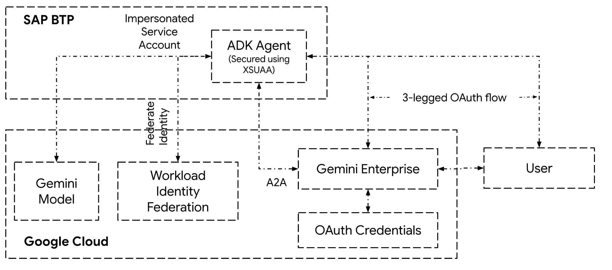
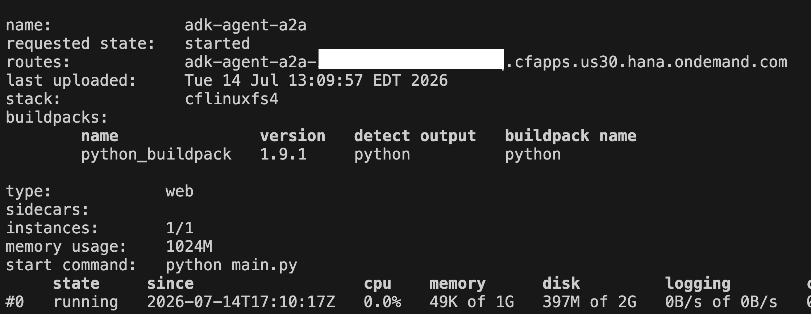
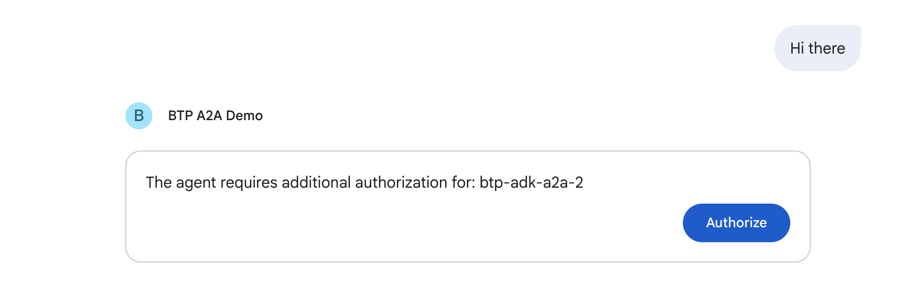
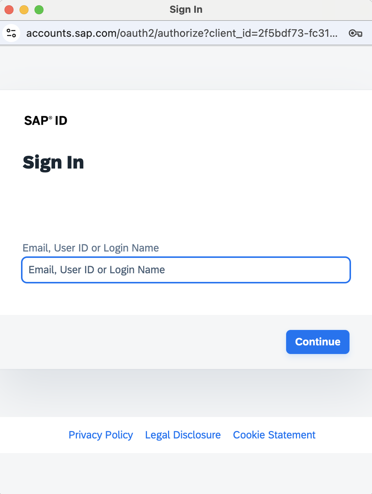
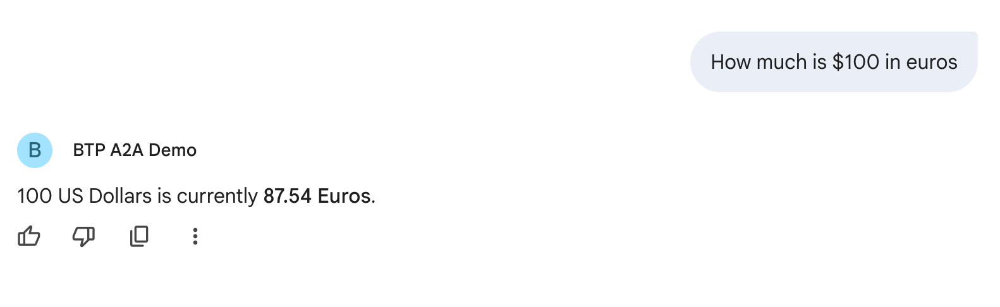

# Tutorial: Deploy Google Cloud ADK Agent to SAP BTP and Consume it in Gemini Enterprise using A2A Protocol

**Tech Stack**: Google Cloud ADK • A2A Protocol • Workload Identity Federation • Gemini Enterprise • SAP BTP • XSUAA • Python

---

## Table of Contents
1. [Introduction](#1-introduction)
2. [Prerequisites & Setup](#2-prerequisites--setup)
3. [Architecture Overview](#3-architecture-overview)
4. [Part 1: Google Cloud & Workload Identity Setup](#4-part-1-google-cloud--workload-identity-setup)
   - [Step 1: Create a Service Account in Google Cloud](#step-1-create-a-service-account-in-google-cloud)
   - [Step 2: Create a Workload Identity Pool and Provider](#step-2-create-a-workload-identity-pool-and-provider)
5. [Part 2: Building and Deploying the ADK Agent](#5-part-2-building-and-deploying-the-adk-agent)
   - [Step 3: Prepare the ADK Agent Project](#step-3-prepare-the-adk-agent-project)
   - [Step 4: Deploy the ADK Agent to SAP BTP](#step-4-deploy-the-adk-agent-to-sap-btp)
6. [Part 3: Registering and Testing in Gemini Enterprise](#6-part-3-registering-and-testing-in-gemini-enterprise)
   - [Step 5: Create an Agent Authorization Resource in Gemini Enterprise](#step-5-create-an-agent-authorization-resource-in-gemini-enterprise)
   - [Step 6: Register the A2A Agent with Gemini Enterprise](#step-6-register-the-a2a-agent-with-gemini-enterprise)
   - [Step 7: Test the Agent in the Gemini Enterprise UI](#step-7-test-the-agent-in-the-gemini-enterprise-ui)
7. [Summary](#7-summary)
8. [Resources](#8-resources)

---

## 1. Introduction

### Overview
This tutorial demonstrates how to deploy a Google Cloud Agent Development Kit (ADK) agent to SAP Business Technology Platform (SAP BTP) and consume it from **Gemini Enterprise** using the **Agent-to-Agent (A2A) Protocol**. 

The ADK agent running on SAP BTP uses **Google Cloud Workload Identity Federation** to securely authenticate to Google Cloud. This enables zero-trust, keyless communication between SAP BTP and Google Cloud without requiring static API keys or long-lived service account JSON keys.

### Goals
- Deploy a Python-based Google Cloud ADK agent to **SAP BTP Cloud Foundry**.
- Configure **Workload Identity Federation** between SAP BTP (XSUAA OIDC issuer) and Google Cloud.
- Register the ADK agent with **Gemini Enterprise** and configure secure server-side OAuth 2.0 authorization.
- Test and converse with the agent via the **Gemini Enterprise UI**.

---

## 2. Prerequisites & Setup

Before starting, verify that you have the following resources and local development tools set up.

### Google Cloud Resources
- A [**Google Cloud Project**](https://console.cloud.google.com/projectselector2/home/dashboard) with [billing enabled](https://docs.cloud.google.com/billing/docs/how-to/verify-billing-enabled#confirm_billing_is_enabled_on_a_project).
- Required **Google Cloud APIs** enabled in your project:
  - [**Gemini Enterprise / Vertex AI Agent Platform API**](https://console.cloud.google.com/flows/enableapi?apiid=aiplatform.googleapis.com)
  - [**Compute Engine API**](https://console.cloud.google.com/flows/enableapi?apiid=compute.googleapis.com)
  - [**Resource Manager API**](https://console.cloud.google.com/flows/enableapi?apiid=cloudresourcemanager.googleapis.com)
  - [**IAM Service Account Credentials API**](https://console.cloud.google.com/project/_/apis/library/iamcredentials.googleapis.com)
  - [**Security Token Service API**](https://console.cloud.google.com/project/_/apis/library/sts.googleapis.com)

### SAP BTP Resources
- An [**SAP BTP Account**](https://account.hana.ondemand.com/).
- The [**Cloud Foundry Environment**](https://help.sap.com/docs/SAP_CLOUD_PLATFORM/65de2977205c403bbc107264b8eccf4b/a4d3dd7482de4089b6572a63753d0434.html) enabled in your subaccount.
- A [**Space**](https://help.sap.com/docs/SAP_CLOUD_PLATFORM/65de2977205c403bbc107264b8eccf4b/1a2f6431947846c0a0f95c47a2aca0bd.html) created in your Cloud Foundry organization.
- An **XSUAA service instance** (`adk-demos`) created following the [previous tutorial](../02-adk-btp-secure/README.md#step-1-create-an-xsuaa-service).

### Local Development Environment
- **uv** [installed](https://docs.astral.sh/uv/getting-started/installation/) along with Python 3.10+ [installed via uv](https://docs.astral.sh/uv/guides/install-python/).
- **gcloud CLI** [installed](https://docs.cloud.google.com/sdk/docs/install-sdk) and [authenticated](https://docs.cloud.google.com/sdk/docs/install-sdk#initializing-the-cli) (`gcloud auth login`).
- **Cloud Foundry CLI (`cf`)** [installed](https://developers.sap.com/tutorials/cp-cf-download-cli.html) and logged in to your SAP BTP Cloud Foundry instance (`cf login`).
- *(Optional)* [**jq**](https://jqlang.org/) installed for parsing JSON and executing API calls.

---

## 3. Architecture Overview

The diagram below illustrates the relationship between the components and the authentication flow that enables the ADK agent running in SAP BTP to communicate with Google Cloud and Gemini Enterprise using the A2A Protocol.

By establishing an OpenID Connect (OIDC) trust relationship via **Workload Identity Federation**, the ADK agent on SAP BTP exchanges its XSUAA JWT token for a temporary Google Cloud STS token, allowing it to impersonate a Google Cloud service account keylessly.



---

## 4. Part 1: Google Cloud & Workload Identity Setup

### Step 1: Create a Service Account in Google Cloud

The ADK agent deployed on SAP BTP accesses Google Cloud resources (such as Vertex AI and Gemini models) by impersonating a designated IAM Service Account.

> [!NOTE]
> Replace `PROJECT_ID` with your Google Cloud project ID across all commands below.

```bash
# 1. Create the service account
gcloud iam service-accounts create btp-adk-demos \
  --description="Service account to be impersonated by BTP Workload Identity provider" \
  --display-name="btp-adk-demos"

# 2. Grant the service account permissions to access Vertex AI
gcloud projects add-iam-policy-binding PROJECT_ID \
  --member="serviceAccount:btp-adk-demos@PROJECT_ID.iam.gserviceaccount.com" \
  --role="roles/aiplatform.user" \
  --no-user-output-enabled
```

### Step 2: Create a Workload Identity Pool and Provider

Configure a Workload Identity Pool and register your SAP BTP XSUAA service as an authorized OIDC identity provider.

> [!NOTE]
> Before running the commands below:
> 1. Retrieve the credentials of the `adk-demos` XSUAA service instance created in the [previous tutorial](../02-adk-btp-secure/README.md#step-1-create-an-xsuaa-service):
>    ```bash
>    cf service-key adk-demos adk-demos-sk
>    ```
> 2. From the JSON output, identify `clientid`, `clientsecret`, and `url`.
> 3. Replace the placeholders below:
>    - `OAUTH_TOKEN_URL`: The `url` from your service key (e.g., `https://xxxxxxx.authentication.us30.hana.ondemand.com`).
>    - `OAUTH_CLIENT_ID`: The `clientid` from your service key.
>    - `PROJECT_ID`: Your Google Cloud project ID.
>    - `PROJECT_NUMBER`: Your Google Cloud project number.

```bash
# 1. Create a Workload Identity Pool
gcloud iam workload-identity-pools create adk-demos \
    --location="global" \
    --display-name="ADK Demos pool" \
    --description="Workload Identity Pool for ADK Demos"

# 2. Create an OIDC Provider linking SAP BTP XSUAA to the pool
# Note: Ensure the issuer-uri ends with /oauth/token exactly once (e.g., https://xxxx.authentication.us30.hana.ondemand.com/oauth/token)
gcloud iam workload-identity-pools providers create-oidc btp-provider \
    --location="global" \
    --workload-identity-pool="adk-demos" \
    --display-name="SAP BTP Provider" \
    --description="SAP BTP Workload Identity provider for ADK demos" \
    --attribute-mapping="google.subject=assertion.email, attribute.client_id=assertion.client_id" \
    --issuer-uri="OAUTH_TOKEN_URL/oauth/token" \
    --allowed-audiences="OAUTH_CLIENT_ID"

# 3. Grant the SAP BTP identity provider permission to impersonate the service account
gcloud iam service-accounts add-iam-policy-binding btp-adk-demos@PROJECT_ID.iam.gserviceaccount.com \
    --role="roles/iam.workloadIdentityUser" \
    --member="principal://iam.googleapis.com/projects/PROJECT_NUMBER/locations/global/workloadIdentityPools/adk-demos/subject/OAUTH_CLIENT_ID"
```

---

## 5. Part 2: Building and Deploying the ADK Agent

### Step 3: Prepare the ADK Agent Project

This repository contains a pre-built ready-to-deploy ADK agent application located inside the [`adk-btp-a2a-agent`](./adk-btp-a2a-agent) directory.

#### Project Structure Overview
If you inspect the [`adk-btp-a2a-agent`](./adk-btp-a2a-agent) folder, you will find the following key components:

1. **[`context_store.py`](./adk-btp-a2a-agent/context_store.py)**: Acts as a thread-safe request isolation container. When incoming requests hit the agent with SAP BTP JWT tokens, this module exchanges the token for impersonated Google Cloud service account credentials via Workload Identity Federation and caches them in memory with a 30-minute time-to-live (TTL).
2. **[`agent.py`](./adk-btp-a2a-agent/agent.py)**: Defines the core ADK agent logic. It configures the Gemini model to use the request-specific impersonated credentials retrieved from the context store (instead of using global Application Default Credentials). It also applies `to_a2a()` to make the agent compatible with the A2A Protocol.
3. **[`main.py`](./adk-btp-a2a-agent/main.py)**: Exposes the agent using Starlette/FastAPI and applies custom middleware (`BaseHTTPMiddleware`) to:
   - Validate that the incoming SAP BTP user is authenticated via XSUAA JWT bearer tokens.
   - Update the auto-generated Agent Card (`/.well-known/agent-card.json`) to declare a JWT bearer token security scheme.
   - Retrieve or create impersonated Google Cloud credentials using Workload Identity Federation.
   - Inject the credentials into the request context for downstream Gemini interactions.
4. **[`manifest.yml`](./adk-btp-a2a-agent/manifest.yml)**: The Cloud Foundry deployment manifest specifying memory (`1024M`), disk quota (`2G`), service bindings (`adk-demos`), and environment configuration.
5. **[`requirements.txt`](./adk-btp-a2a-agent/requirements.txt) & [`runtime.txt`](./adk-btp-a2a-agent/runtime.txt)**: Specifies Python dependencies (`google-adk[a2a]`, `a2a-sdk`, `fastapi`, `sap-xssec`, etc.) and sets the runtime version (`python-3.13.x`).

#### Configure Environment Variables
Before deploying, update or verify the configuration inside the **[`adk-btp-a2a-agent/.env`](./adk-btp-a2a-agent/.env)** file:

```ini
GOOGLE_CLOUD_PROJECT=<YOUR_PROJECT_ID>
GOOGLE_CLOUD_PROJECT_NUMBER=<YOUR_PROJECT_NUMBER>
VERTEX_AI_LOCATION=global
GOOGLE_GENAI_USE_VERTEXAI=TRUE

WIF_POOL_ID=adk-demos
WIF_POOL_LOCATION=global
WIF_PROVIDER_ID=btp-provider
TARGET_SERVICE_ACCOUNT=btp-adk-demos@<YOUR_PROJECT_ID>.iam.gserviceaccount.com

ADK_SUPPRESS_EXPERIMENTAL_FEATURE_WARNINGS=1
ADK_SUPPRESS_A2A_EXPERIMENTAL_FEATURE_WARNINGS=1
```

### Step 4: Deploy the ADK Agent to SAP BTP

Deploy the prepared application to your SAP BTP Cloud Foundry space using the `cf push` command:

```bash
# Navigate into the agent project directory
cd adk-btp-a2a-agent

# Ensure you are logged in to your target SAP BTP organization and space
cf login

# Push the application using manifest.yml
cf push
```

If the deployment completes successfully, the terminal output will confirm the running instance and display the assigned route URL (e.g., `https://adk-agent-a2a-xxxxxxx.cfapps.us30.hana.ondemand.com`). 

You can verify that the agent is live by visiting its Agent Card endpoint:
`https://<YOUR_BTP_ROUTE_URL>/.well-known/agent-card.json`



---

## 6. Part 3: Registering and Testing in Gemini Enterprise

### Step 5: Create an Agent Authorization Resource in Gemini Enterprise

Create a server-side OAuth 2.0 authorization resource in Gemini Enterprise so that it knows how to authenticate against your SAP BTP XSUAA tenant when invoking the agent.

> [!NOTE]
> Replace the placeholders below:
> - `PROJECT_ID`: Your Google Cloud project ID.
> - `PROJECT_NUMBER`: Your Google Cloud project number.
> - `ENDPOINT_LOCATION`: Location of Discovery Engine (e.g., `global`, `us`, or `eu`).
> - `LOCATION`: Location of Discovery Engine (e.g., `global`, `us`, or `eu`).
> - `AUTH_ID`: A unique ID for this authorization config (e.g., `btp-adk-a2a`).
> - `OAUTH_CLIENT_ID` & `OAUTH_CLIENT_SECRET`: From your `adk-demos` XSUAA service key.
> - `OAUTH_AUTH_URI`: Authorization endpoint from XSUAA service key (e.g., `https://xxxxxxx.authentication.us30.hana.ondemand.com/oauth/authorize`).
> - `OAUTH_TOKEN_URI`: Token endpoint from XSUAA service key (e.g., `https://xxxxxxx.authentication.us30.hana.ondemand.com/oauth/token`).

```bash
curl -X POST \
  -H "Authorization: Bearer $(gcloud auth application-default print-access-token)" \
  -H "Content-Type: application/json" \
  -H "X-Goog-User-Project: PROJECT_ID" \
  "https://ENDPOINT_LOCATION-discoveryengine.googleapis.com/v1alpha/projects/PROJECT_NUMBER/locations/LOCATION/authorizations?authorizationId=AUTH_ID" \
  -d '{
    "name": "projects/PROJECT_NUMBER/locations/LOCATION/authorizations/AUTH_ID",
    "serverSideOauth2": {
      "clientId": "OAUTH_CLIENT_ID",
      "clientSecret": "OAUTH_CLIENT_SECRET",
      "authorizationUri": "OAUTH_AUTH_URI?scope=uaa.user&response_type=code&access_type=offline&prompt=consent",
      "tokenUri": "OAUTH_TOKEN_URI"
    }
  }'
```

### Step 6: Register the A2A Agent with Gemini Enterprise

Next, download the live Agent Card from your deployed SAP BTP app and register the A2A agent inside your Gemini Enterprise application.

```bash
# 1. Download the agent card from your running SAP BTP agent
# Replace <YOUR_BTP_AGENT_URL> with the actual route (e.g., https://adk-agent-a2a-xxxx.cfapps.us30.hana.ondemand.com)
curl -s https://<YOUR_BTP_AGENT_URL>/.well-known/agent-card.json > agent_card.json
```

Now, register the downloaded card and link it to the authorization configuration created in Step 5:

> [!NOTE]
> Replace `APP_ID` with the ID of your target Gemini Enterprise / Discovery Engine App.

```bash
# 2. Register the A2A agent with Gemini Enterprise
curl -X POST \
  -H "Authorization: Bearer $(gcloud auth application-default print-access-token)" \
  -H "Content-Type: application/json" \
  -H "X-Goog-User-Project: PROJECT_ID" \
  "https://ENDPOINT_LOCATION-discoveryengine.googleapis.com/v1alpha/projects/PROJECT_NUMBER/locations/LOCATION/collections/default_collection/engines/APP_ID/assistants/default_assistant/agents" \
  -d "$(jq -n \
    --slurpfile card agent_card.json \
    '{
       "displayName": "BTP A2A Demo",
       "description": "Demo BTP ADK Agent through A2A",
       "a2aAgentDefinition": {
         "jsonAgentCard": ($card[0] | tostring)
       },
       "authorizationConfig": {
         "agentAuthorization": "projects/PROJECT_NUMBER/locations/LOCATION/authorizations/AUTH_ID"
       }
     }')"
```

> [!TIP]
> If `jq` is not available in your local environment, you can also register the agent through the Google Cloud Console UI following the [Register an A2A agent documentation](https://docs.cloud.google.com/gemini/enterprise/docs/register-and-manage-an-a2a-agent#register-agent).

### Step 7: Test the Agent in the Gemini Enterprise UI

1. Open your **Gemini Enterprise Application** in the web browser. Under the **Agents** section, you should see the newly registered `BTP ADK Demo` card.
2. When you select or converse with the `BTP ADK Demo` agent for the first time, Gemini Enterprise prompts you to authorize via OAuth:

   

3. Clicking **Authorize** redirects you to your SAP BTP XSUAA login page:

   

4. Once logged in and authenticated, you are returned to Gemini Enterprise and can converse directly with the agent running on SAP BTP:

   

---

## 7. Summary

In this tutorial, you accomplished the following:
- **Deployed an ADK Agent to SAP BTP**: Built and hosted a Starlette/FastAPI-based agent on Cloud Foundry.
- **Configured Keyless Authentication**: Established **Workload Identity Federation** between SAP BTP (OIDC) and Google Cloud, eliminating the security risk of storing static Google Cloud service account keys.
- **Registered an A2A Agent in Gemini Enterprise**: Linked the agent card and created a server-side OAuth 2.0 authorization resource to handle secure token exchanges automatically.
- **Enabled Seamless User Interaction**: Connected authenticated SAP BTP users directly to generative AI workflows inside the Gemini Enterprise UI.

---

## 8. Resources

- [Google Cloud Agent Development Kit (ADK) Documentation](https://google.github.io/adk-docs/)
- [Gemini Enterprise - Register and Manage an A2A Agent](https://docs.cloud.google.com/gemini/enterprise/docs/register-and-manage-an-a2a-agent)
- [Gemini Enterprise Agent Platform - Agent Runtime](https://docs.cloud.google.com/gemini-enterprise-agent-platform/build/runtime)
- [Generative AI on Vertex AI Overview](https://docs.cloud.google.com/vertex-ai/generative-ai/docs/learn/overview)
